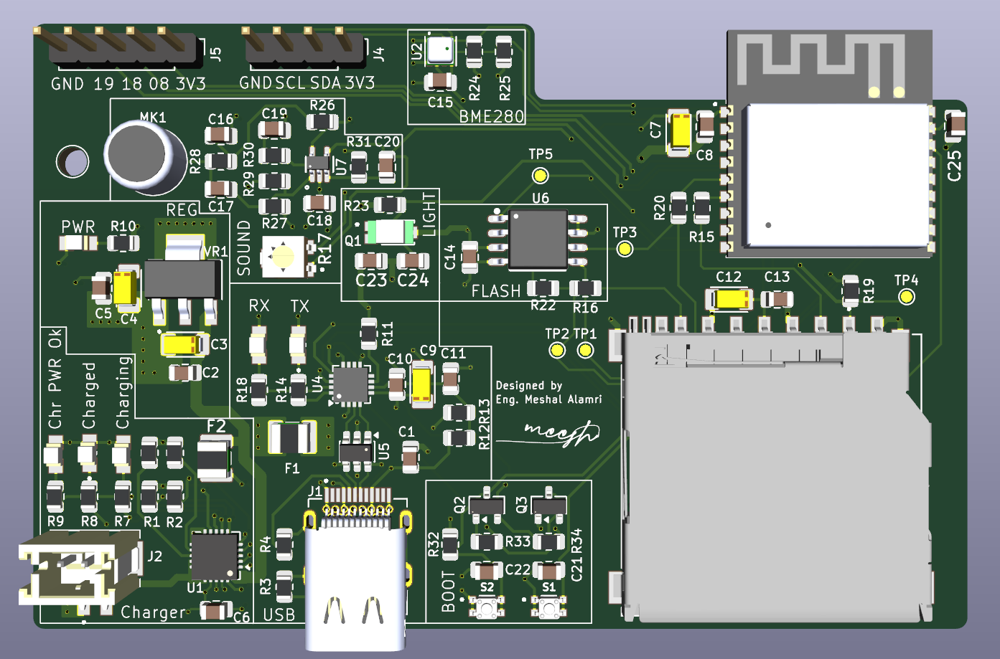

# ESP32_IoT_Dev_Board

📄 **[View Complete Schematic PDF](ESP32_IoT_Project.pdf)**

A custom 4-layer IoT development board based on the ESP32-C3, featuring integrated LiPo battery management, a CP2102N USB-UART bridge, MicroSD support, and onboard environmental/audio sensors for embedded engineering applications.

This repository contains the KiCad 10 design files, schematics, and manufacturing data for a custom Internet of Things development board built around the ESP32-C3-WROOM-02-H4 module. The board is designed for educational purposes, sensor integration testing, and embedded systems prototyping. The physical PCB silkscreen attributes the design directly to Eng. Meshal Alamri.

## Hardware Specifications:

* Core Microcontroller: ESP32-C3-WROOM-02-H4 module with Wi-Fi and Bluetooth LE capabilities.

* USB Interface: USB Type-C connector (SS-52400-003) routed through a CP2102N USB-to-UART bridge, protected by a USBLC6-2SC6 ESD suppression IC.

* Power Management: LM1117 3.3V LDO regulator and an MCP73871 charge management controller for handling LiPo batteries via a JST B2B-PH-SM4-TB surface-mount connector.

* External Storage: MicroSD card slot (GSD090012SEU) for data logging applications.

* Additional Memory: W25Q32JVSSIQ 32Mbit SPI Flash memory.

* Integrated Sensors:

* BME280 for temperature, humidity, and pressure monitoring.

* MAX4466 electret microphone amplifier circuit with a manual gain control trimpot (VR1) for audio sampling.

* TEMT6000X01 ambient light sensor.

* User Interface: Tactile buttons for Boot (S2) and Reset (S1), alongside dedicated status LEDs indicating power, charging state, and serial TX/RX activity.
